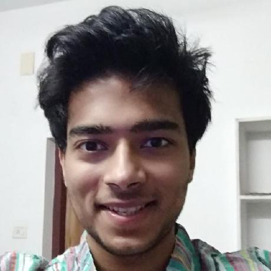

## About Me

Hi! I am an MS Computer Science student at Georgia Tech.
I'm interested in computer vision and deep learning with an emphasis on perception related problems.

## Experience

### [Blue Vision Labs](https://www.bluevisionlabs.com), London, United Kingdom

Research Engineering Intern
 
May 2017 - Mar 2018

### [CGG, Charles University](http://cgg.mff.cuni.cz/), Prague, Czech Republic

 Research Intern, Computer Graphics Group
 
 Nov 2015 - Jul 2016

### [Google Summer of Code](https://www.google-melange.com/archive/gsoc/2014), Remote, India

 Contract Developer
 
 May 2014 - Aug 2014

## Education

### [Georgia Institute of Technology](https://www.cc.gatech.edu), Atlanta, United States

MS Computer Science
 
Aug 2016 - May 2018

### [Universidad de Zaragoza](https://www.cc.gatech.edu), Zaragoza, Spain

Visiting student, Graphics and Imaging Lab
 
Jan 2015 - Jun 2015

### [BITS Pilani](https://www.cc.gatech.edu), Goa, India

BE(Hons) Electrical and Electronics
 
Aug 2011 - Aug 2015
